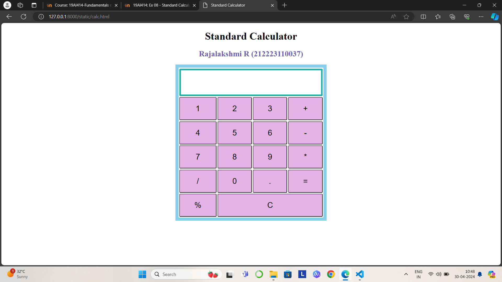
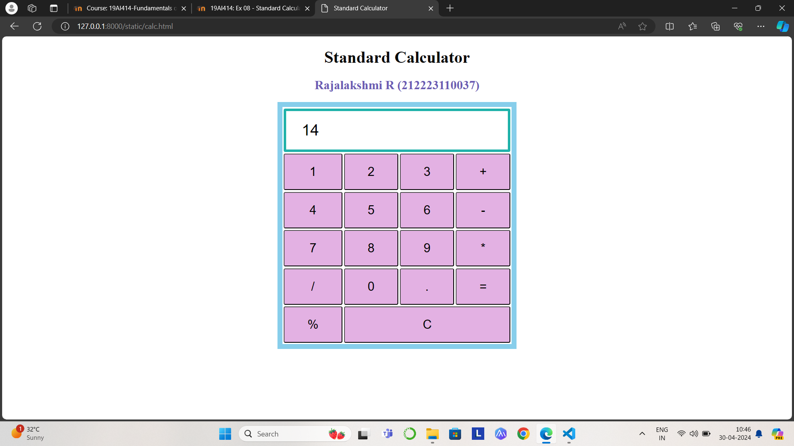

# Ex.08 Design of a Standard Calculator
## Date: 25.04.2024

## AIM:
To design a web application for a standard calculator with minimum five operations.

## DESIGN STEPS:
### Step 1:
Clone the github repository and create Django admin interface.

### Step 2:
Change settings.py file to allow request from all hosts.

### Step 3:
Use CSS for creating attractive colors.

### Step 4:
Write JavaScript program for implementing five different operations.

### Step 5:
Validate the HTML and CSS code.

### Step 6:
Publish the website in the given URL.

## PROGRAM :
```
<!DOCTYPE html>
<html lang="en">
    <head>
        <title> Standard Calculator</title>
        <title> Rajalakshmi R (212223110037) </title>
        <style>
        table{
            border: 10px solid skyblue;
            margin-left: auto;
            margin-right: auto;
        }
        input[type="text"]{
            border: 5px solid lightseagreen;
            padding: 20px 30px;
            font-size: 30px;
            font-weight: italic;
            border-radius: 3px;
        }


        input[type="button"]{
            width: 100%;
            padding: 20px 40px;
            background-color: rgba(221, 160, 221, 0.825);
            border-radius: 3px;
            font-size: x-large;
        }
        </style>
    </head>
    <body>
        <form name="form1" onload="result.value=''">
            <h1 style="text-align: center;color:rgb(10, 10, 10);">Standard Calculator</h1>
            <h2 style="text-align: center;color:rgb(108, 92, 179);">Rajalakshmi R (212223110037) </h2>

        <table id="calc">
            <tr>
                <td colspan="4">
                    <input type="text" id="result">
                </td>
            </tr>
            <tr>
                <td><input type="button" value="1" onclick="result.value+='1'"></td>
                <td><input type="button" value="2" onclick="result.value+='2'"></td>
                <td><input type="button" value="3" onclick="result.value+='3'"></td>
                <td><input type="button" value="+" onclick="result.value+='+'"></td>
            </tr>
            <tr>
                <td><input type="button" value="4" onclick="result.value+='4'"></td>
                <td><input type="button" value="5" onclick="result.value+='5'"></td>
                <td><input type="button" value="6" onclick="result.value+='6'"></td>
                <td><input type="button" value="-" onclick="result.value+='-'"></td>
            </tr>
            <tr>
                <td><input type="button" value="7" onclick="result.value+='7'"></td>
                <td><input type="button" value="8" onclick="result.value+='8'"></td>
                <td><input type="button" value="9" onclick="result.value+='9'"></td>
                <td><input type="button" value="*" onclick="result.value+='*'"></td>
            </tr>
            <tr>
                <td><input type="button" value="/" onclick="result.value+='/'"></td>
                <td><input type="button" value="0" onclick="result.value+='0'"></td>
                <td><input type="button" value="." onclick="result.value+='.'"></td>
                <td><input type="button" value="=" onclick="result.value=eval(result.value)"></td>
            </tr>
            <tr>
                <td><input type="Button" value="%" onclick="result.value+='%'"></td>
                <td colspan="3">
                    <input type="button" value="C" id="clear" onclick="result.value=''">
                </td>
            </tr>
        </table>
        </form>
   </body>
</html>
```

## OUTPUT:


### Addition:




## RESULT:
The program for designing a standard calculator using HTML and CSS is executed successfully.